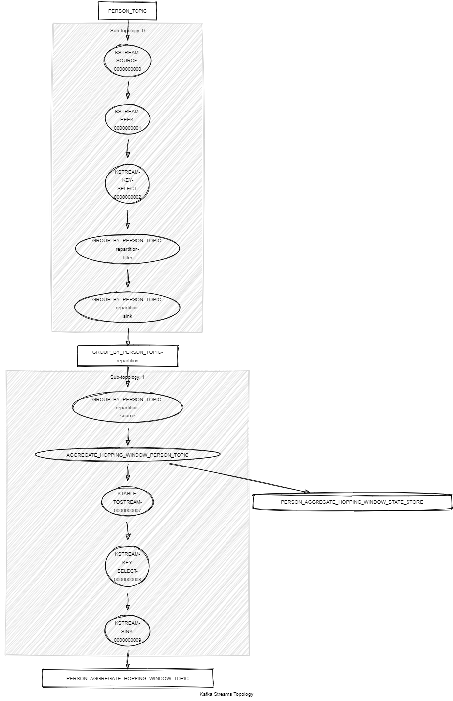

# Kafka Streams Aggregate Hopping Window

This module streams records of type `<String, KafkaUser>` from the `USER_TOPIC` and aggregates users by last name using a 5-minute time window with a 2-minute hop, and a 1-minute grace period for
delayed records.
It demonstrates the following:

- How to use the Kafka Streams DSL, including `aggregate()`, `windowedBy().advanceBy()`, `groupByKey()`, `selectKey()`, `toStream()` and `peek()`.
- Unit testing using the Topology Test Driver.



## Prerequisites

To compile and run this demo, you’ll need:

- Java 21
- Maven
- Docker

## Running the Application

To run the application manually:

- Start a [Confluent Platform](https://docs.confluent.io/platform/current/quickstart/ce-docker-quickstart.html#step-1-download-and-start-cp) in a Docker environment.
- Produce records of type `<String, KafkaUser>` to the `USER_TOPIC`. You can use the [Producer User](../specific-producers/kafka-streams-producer-user) for this.
- Start the Kafka Streams application.

To run the application in Docker, use the following command:

```console
docker-compose up -d
```

This command will start the following services in Docker:

- 1 Kafka Broker (KRaft mode)
- 1 Schema Registry
- 1 Control Center
- 1 Producer User
- 1 Kafka Streams Aggregate Hopping Window
