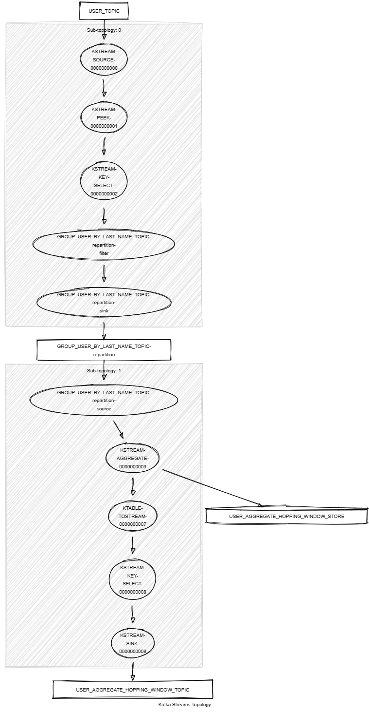

# Kafka Streams Aggregate Hopping Window

This module shows:
- Kafka Streams API: `windowedBy().advanceBy()`, `aggregate()`, `groupByKey()`, `selectKey()`, `toStream()`, `peek()`
- unit tests with Topology Test Driver

This module does:
- stream <String,KafkaPerson> records from a topic named PERSON_TOPIC
- group the stream by last name and apply an aggregator. 
The aggregator combines each KafkaPerson with the same key into a KafkaPersonGroup object and aggregate first names by last name.
The aggregations are performed by time window of 5 minutes and a 2-minute hop each.

```json
{"firstNameByLastName":{"Last name 1":{"First name 1", "First name 2", "First name 3")}}
{"firstNameByLastName":{"Last name 2":{"First name 4", "First name 5", "First name 6")}}
{"firstNameByLastName":{"Last name 3":{"First name 7", "First name 8", "First name 9")}}
```



## Requirements

To compile and run this demo you will need:
- Java 17
- Maven
- Docker

## Run the app

For manual run:
- start a [Confluent Platform](https://docs.confluent.io/platform/current/quickstart/ce-docker-quickstart.html#step-1-download-and-start-cp) in Docker
- produce <String,KafkaPerson> records to a topic named PERSON_TOPIC. The [producer person](../specific-producers/kafka-streams-producer-person) can be used
- start the Kafka Streams

For Docker run:
- start the provided docker-compose 

```
docker compose up -d
```

The docker compose runs:
- 1 Zookeeper
- 1 Kafka broker
- 1 Schema registry
- 1 Control Center
- 1 producer person
- 1 Kafka Streams aggregate hopping window
