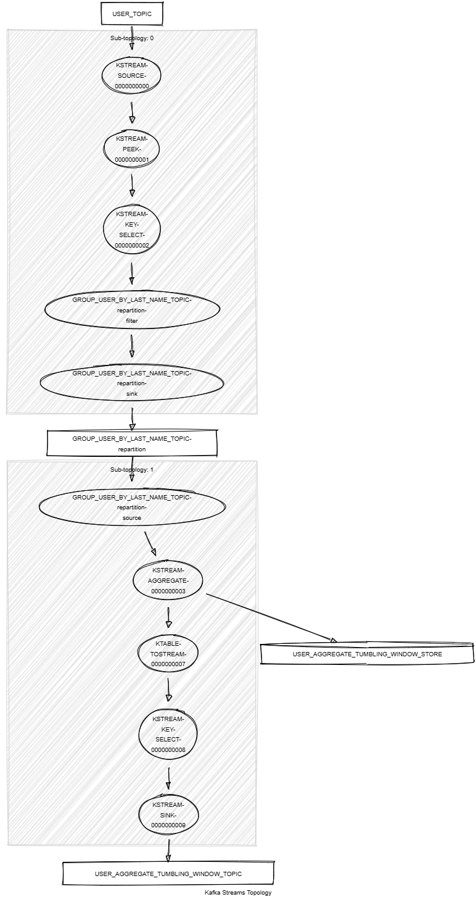

# Kafka Streams Aggregate Tumbling Window

This module demonstrates the following:

- The usage of the Kafka Streams DSL, including `aggregate()`, `windowedBy()`, `groupByKey()`, `selectKey()`, `toStream()` and `peek()`.
- Unit testing using the Topology Test Driver.

In this module, records of type `<String, KafkaPerson>` are streamed from a topic named `PERSON_TOPIC`.
The following tasks are performed:

1. Group the stream by last name using `groupByKey()` operation.
2. Apply an aggregator that combines each `KafkaPerson` record with the same last name into a `KafkaPersonGroup` object
   and aggregates the first names by last name.
3. The aggregations are performed using a 5-minute tumbling window and a 1-minute grace period for delayed records.
4. Write the resulting records to a new topic named `PERSON_AGGREGATE_TUMBLING_WINDOW_TOPIC`.

The output records will be in the following format:

```json
{"firstNameByLastName":{"Last name 1":{"First name 1", "First name 2", "First name 3"}}}
{"firstNameByLastName":{"Last name 2":{"First name 4", "First name 5", "First name 6"}}}
{"firstNameByLastName":{"Last name 3":{"First name 7", "First name 8", "First name 9"}}}
```



## Requirements

To compile and run this demo, you will need the following:

- Java 21
- Maven
- Docker

## Running the Application

To run the application manually, please follow the steps below:

- Start a [Confluent Platform](https://docs.confluent.io/platform/current/quickstart/ce-docker-quickstart.html#step-1-download-and-start-cp) in a Docker environment.
- Produce records of type `<String, KafkaPerson>` to a topic named `PERSON_TOPIC`. You can use the [producer person](../specific-producers/kafka-streams-producer-person) to do this.
- Start the Kafka Streams.

To run the application in Docker, please use the following command:

```console
docker-compose up -d
```

This command will start the following services in Docker:

- 1 Kafka broker KRaft
- 1 Schema registry
- 1 Control Center
- 1 producer Person
- 1 Kafka Streams Aggregate Tumbling Window
