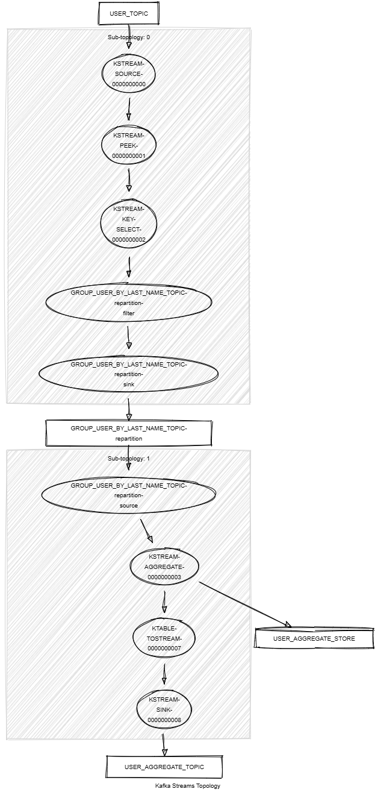

# Kafka Streams Aggregate

This module demonstrates:

- The use of the Kafka Streams API: `aggregate()`, `groupByKey()`, `selectKey()`, `toStream()`, `peek()`.
- The use of unit tests with Topology Test Driver.

This module does:

- Stream records of type <String,KafkaPerson> from a topic named PERSON_TOPIC.
- Group the stream by last name and apply an aggregator. 
The aggregator combines each KafkaPerson with the same key into a KafkaPersonGroup object and aggregate first names by last name.

```json
{"firstNameByLastName":{"Last name 1":{"First name 1", "First name 2", "First name 3"}}}
{"firstNameByLastName":{"Last name 2":{"First name 4", "First name 5", "First name 6"}}}
{"firstNameByLastName":{"Last name 3":{"First name 7", "First name 8", "First name 9"}}}
```

- Write the result into a new topic named PERSON_AGGREGATE_TOPIC.



## Requirements

To compile and run this demo, you will need the following:

- Java 17
- Maven
- Docker

## Running the Application

To run the application manually, please follow the steps below:

- Start a [Confluent Platform](https://docs.confluent.io/platform/current/quickstart/ce-docker-quickstart.html#step-1-download-and-start-cp) in a Docker environment.
- Produce records of type <String,KafkaPerson> to a topic named PERSON_TOPIC. You can use the [producer person](../specific-producers/kafka-streams-producer-person) to do this.
- Start the Kafka Streams.

To run the application in Docker, please use the following command:

```console
docker-compose up -d
```

This command will start the following services in Docker:

- 1 Zookeeper
- 1 Kafka broker
- 1 Schema registry
- 1 Control Center
- 1 producer person
- 1 Kafka Streams aggregate
