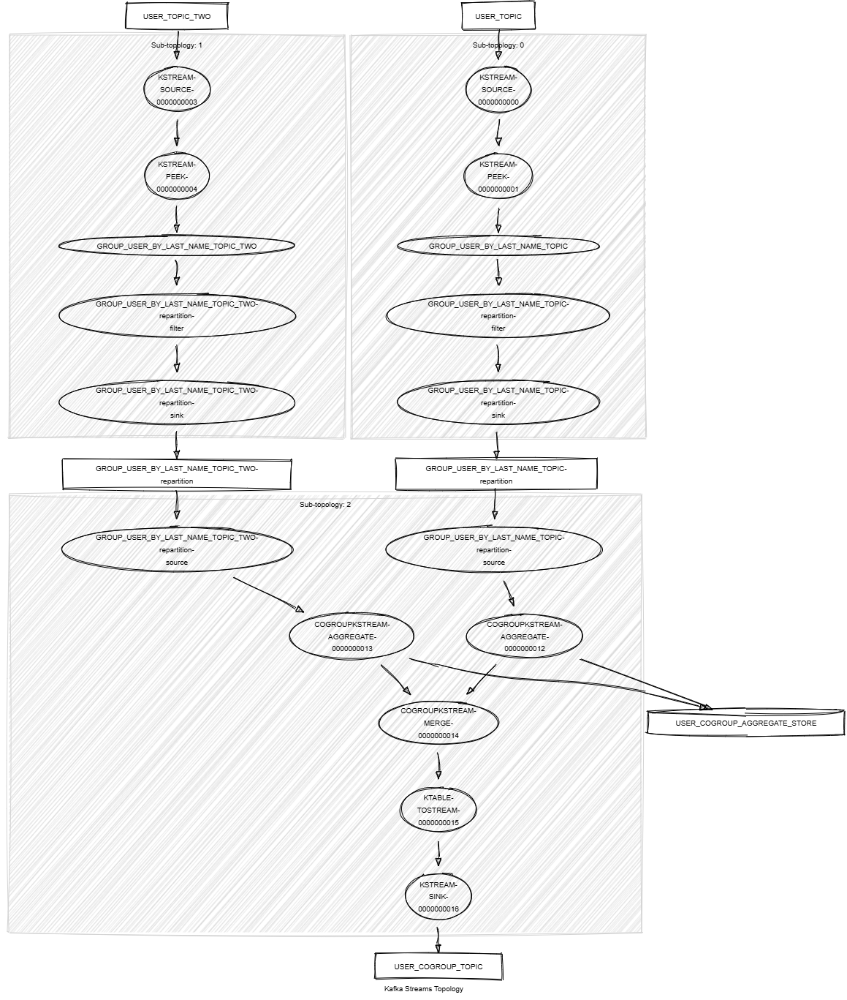

# Kafka Streams Cogroup

This module demonstrates the following:

- The use of the Kafka Streams DSL, including `cogroup()`, `groupBy()`, `aggregate()`, `toStream()` and `peek()`.
- Unit testing using Topology Test Driver.

In this module, records of type `<String, KafkaUser>` are streamed from two topics named `USER_TOPIC`
and `USER_TOPIC_TWO`.
The streams are processed using the Kafka Streams DSL to perform cogrouping based on the last name of each `KafkaUser`
record.
The following tasks are performed:

1. Group the streams by last name using the `groupBy()` operation.
2. Apply a cogroup operation to combine the records from both streams with the same last name.
3. Apply an aggregator that combines each `KafkaUser` record with the same last name into a `KafkaUserGroup` object
   and aggregates the first names by last name.
4. Write the resulting records to a new topic named `USER_COGROUP_TOPIC`.

The output records will be in the following format:

```json
{"firstNameByLastName":{"Last name 1":{"First name 1", "First name 2", "First name 3"}}}
{"firstNameByLastName":{"Last name 2":{"First name 4", "First name 5", "First name 6"}}}
{"firstNameByLastName":{"Last name 3":{"First name 7", "First name 8", "First name 9"}}}
```



## Requirements

To compile and run this demo, you will need the following:

- Java 21
- Maven
- Docker

## Running the Application

To run the application manually, please follow the steps below:

- Start a [Confluent Platform](https://docs.confluent.io/platform/current/quickstart/ce-docker-quickstart.html#step-1-download-and-start-cp) in a Docker environment.
- Produce records of type `<String, KafkaUser>` to topics named `USER_TOPIC` and `USER_TOPIC_TWO`. You can use the [producer user](../specific-producers/kafka-streams-producer-user) to do this.
- Start the Kafka Streams.

To run the application in Docker, please use the following command:

```console
docker-compose up -d
```

This command will start the following services in Docker:

- 1 Kafka broker KRaft
- 1 Schema registry
- 1 Control Center
- 1 producer User
- 1 Kafka Streams Cogroup
