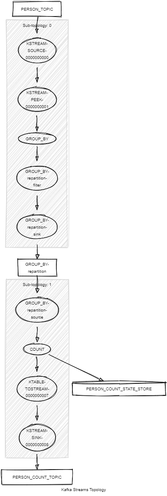

# Kafka Streams Count

This module shows:
- Kafka Streams API: `count()`, `groupBy()`, `toStream()`, `peek()`
- unit tests with Topology Test Driver

This module does:
- stream <String,KafkaPerson> records from a topic named PERSON_TOPIC
- group the stream by nationality and count the number of KafkaPerson for each nationality. 



## Requirements

To compile and run this demo you will need:
- Java 17
- Maven
- Docker

## Run the app

For manual run:
- start a [Confluent Platform](https://docs.confluent.io/platform/current/quickstart/ce-docker-quickstart.html#step-1-download-and-start-cp) in Docker
- produce <String,KafkaPerson> records to a topic named PERSON_TOPIC. The [producer person](../specific-producers/kafka-streams-producer-person) can be used
- start the Kafka Streams

For Docker run:
- start the provided docker-compose 

```
docker compose up -d
```

The docker compose runs:
- 1 Zookeeper
- 1 Kafka broker
- 1 Schema registry
- 1 Control Center
- 1 producer person
- 1 Kafka Streams count
