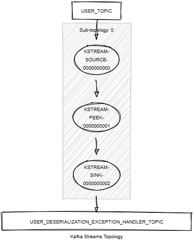

# Kafka Streams Deserialization Exception Handler

This module demonstrates the following:

- The use of the Kafka Streams configuration `default.deserialization.exception.handler` to handle deserialization exceptions.
- The implementation of a custom deserialization exception handler.
- Unit testing using Topology Test Driver.

In this module, records of type `<String, KafkaUser>` are streamed from a topic named `USER_TOPIC`.
The following tasks are performed:

1. Log the received records.
2. Write the records as they are to a new topic named `USER_DESERIALIZATION_EXCEPTION_HANDLER_TOPIC`.

The custom deserialization exception handler is invoked when the configured serdes fail to deserialize the records.
It logs the exceptions and continues processing.



## Prerequisites

To compile and run this demo, you will need the following:

- Java 21
- Maven
- Docker

## Running the Application

To run the application manually:

- Start a [Confluent Platform](https://docs.confluent.io/platform/current/quickstart/ce-docker-quickstart.html#step-1-download-and-start-cp) in a Docker environment.
- Produce records of type `<String, KafkaUser>` to a topic named `USER_TOPIC`. You can use the [producer user](../specific-producers/kafka-streams-producer-user) to do this.
- Start the Kafka Streams.
- To activate the custom deserialization exception handler, produce a record with a value that cannot be deserialized to the `KafkaUser` type to the `USER_TOPIC` (e.g., a record with a value that is not in Avro format). 
  You can use the Control Center to do this.

To run the application in Docker, use the following command:

```console
docker-compose up -d
```

This command will start the following services in Docker:

- 1 Kafka broker (KRaft mode)
- 1 Schema registry
- 1 Control Center
- 1 producer User
- 1 Kafka Streams Exception Handler Deserialization
