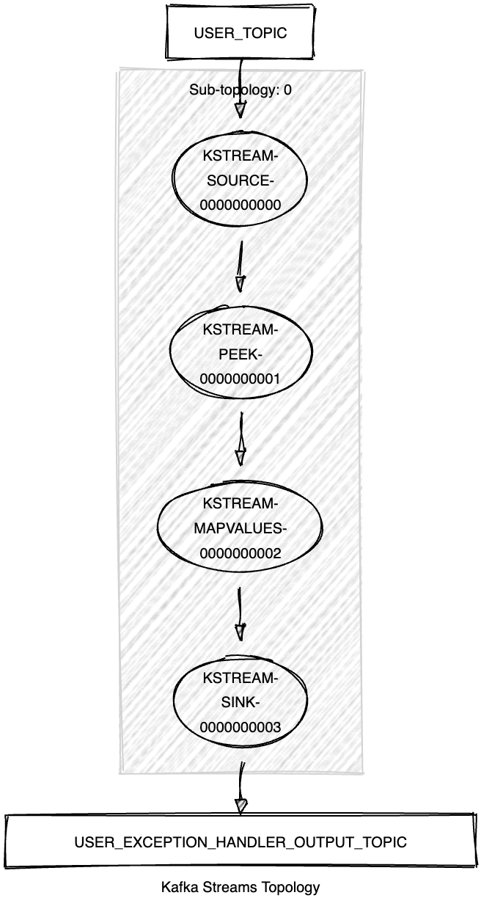

# Kafka Streams Exception Handler DLQ

This module streams records of type `<String, KafkaUser>` from the `USER_TOPIC` and routes exceptions to a Dead Letter Queue (DLQ) topic using the Kafka Streams native DLQ support.

It demonstrates the following:

- How to use the Kafka Streams configuration `errors.dead.letter.queue.topic.name` to make the default deserialization, processing, and production exception handlers route exceptions to the configured DLQ topic, as introduced by [KIP-1034](https://cwiki.apache.org/confluence/display/KAFKA/KIP-1034%3A+Dead+letter+queue+in+Kafka+Streams).
- Unit testing using the Topology Test Driver.



## Prerequisites

To compile and run this demo, you'll need:

- Java 25
- Maven
- Docker

## Running the Application

To run the application manually:

- Start a [Confluent Platform](https://docs.confluent.io/platform/current/quickstart/ce-docker-quickstart.html#step-1-download-and-start-cp) in a Docker environment.
- Produce records of type `<String, KafkaUser>` to the `USER_TOPIC`. You can use the [Producer User](../specific-producers/kafka-streams-producer-user) for this.
- Start the Kafka Streams application.

Alternatively, to run everything at once using Docker, run:

```bash
docker-compose up -d
```

This will start the following services in Docker:

- Kafka Broker
- Schema Registry
- Control Center
- Producer User
- Kafka Streams Exception Handler DLQ
