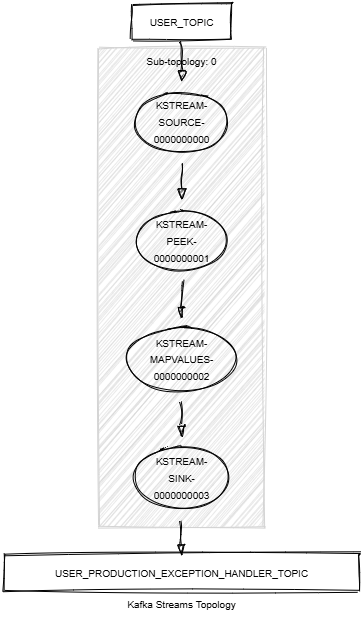

# Kafka Streams Production Exception Handler

This module demonstrates the following:

- The use of the Kafka Streams configuration `default.production.exception.handler` to handle production and serialization exceptions.
- The implementation of a custom production exception handler.
- Unit testing using Topology Test Driver.

In this module, records of type `<String, KafkaUser>` are streamed from a topic named `USER_TOPIC`.
The following tasks are performed:

1. Populate the `email` field of some records changing the record type from `KafkaUser` to `KafkaUserWithEmail`.
   Triggers a serialization exception when registering the new Avro schema as the new record type is not backward
   compatible with the previous record type.
2. Populate the `biography` field of some records with a large text that exceeds the maximum record size allowed by Kafka (1MiB).
   Triggers a production exception when sending the record to Kafka as the record is too large.
3. Write the resulting records to a new topic named `USER_PRODUCTION_EXCEPTION_HANDLER_TOPIC`.

The custom production exception handler is invoked when records fail to be sent to Kafka or when the configured serdes fail to serialize the records.
It logs the exceptions and either continues processing or fails the pipeline based on the exception type.



## Prerequisites

To compile and run this demo, you will need the following:

- Java 21
- Maven
- Docker

## Running the Application

To run the application manually:

- Start a [Confluent Platform](https://docs.confluent.io/platform/current/quickstart/ce-docker-quickstart.html#step-1-download-and-start-cp) in a Docker environment.
- Produce records of type `<String, KafkaUser>` to a topic named `USER_TOPIC`. You can use the [producer user](../specific-producers/kafka-streams-producer-user) to do this.
- Start the Kafka Streams.

To run the application in Docker, use the following command:

```console
docker-compose up -d
```

This command will start the following services in Docker:

- 1 Kafka broker (KRaft mode)
- 1 Schema registry
- 1 Control Center
- 1 producer User
- 1 Kafka Streams Exception Handler Production
