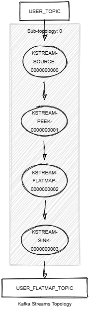

# Kafka Streams FlatMap

This module demonstrates the following:

- The usage of the Kafka Streams DSL, including `flatMap()` and `peek()`.
- Unit testing using the Topology Test Driver.

In this module, records of type `<String, KafkaPerson>` are streamed from a topic named `PERSON_TOPIC`. 
The following tasks are performed:

1. Map the `KafkaPerson` value to extract both the first name and last name.
2. Convert the respective keys to uppercase for the first name and last name.
3. Flatten the resulting key-value pairs.
4. Write the flattened key-value pairs into a new topic named `PERSON_FLATMAP_TOPIC`.



## Requirements

To compile and run this demo, you will need the following:

- Java 17
- Maven
- Docker

## Running the Application

To run the application manually, please follow the steps below:

- Start a [Confluent Platform](https://docs.confluent.io/platform/current/quickstart/ce-docker-quickstart.html#step-1-download-and-start-cp) in a Docker environment.
- Produce records of type `<String, KafkaPerson>` to a topic named `PERSON_TOPIC`. You can use the [producer person](../specific-producers/kafka-streams-producer-person) to do this.
- Start the Kafka Streams.

To run the application in Docker, please use the following command:

```console
docker-compose up -d
```

This command will start the following services in Docker:

- 1 Zookeeper
- 1 Kafka broker
- 1 Schema registry
- 1 Control Center
- 1 producer person
- 1 Kafka Streams flatmap
