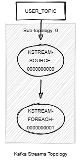

# Kafka Streams Foreach

This module streams records of type `<String, KafkaUser>` from the `USER_TOPIC` and logs each record to the console.
It demonstrates how to use the Kafka Streams DSL `foreach()`.



## Prerequisites

To compile and run this demo, you’ll need:

- Java 21
- Maven
- Docker

## Running the Application

To run the application manually:

- Start a [Confluent Platform](https://docs.confluent.io/platform/current/quickstart/ce-docker-quickstart.html#step-1-download-and-start-cp) in a Docker environment.
- Produce records of type `<String, KafkaUser>` to the `USER_TOPIC`. You can use the [Producer User](../specific-producers/kafka-streams-producer-user) for this.
- Start the Kafka Streams application.

Alternatively, to run everything at once using Docker, run:

```bash
docker-compose up -d
```

This will start the following services in Docker:

- Kafka Broker
- Schema Registry
- Control Center
- Producer User
- Kafka Streams Foreach
