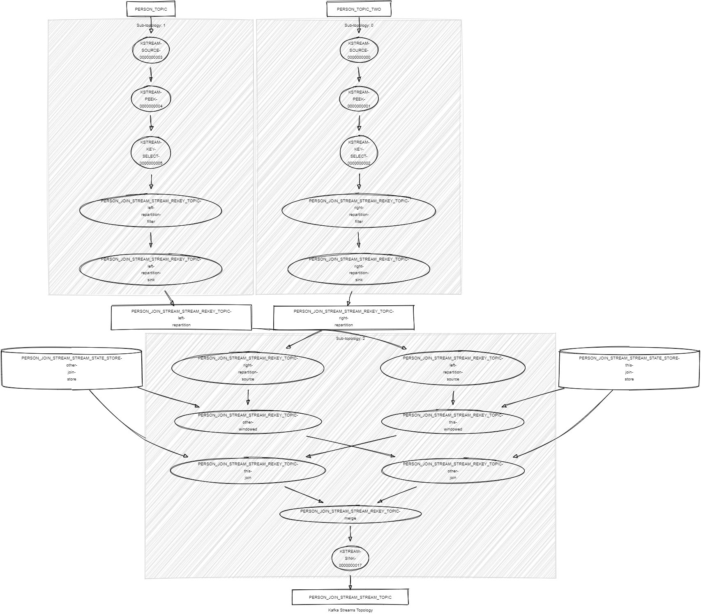

# Kafka Streams Join Stream Stream

This module demonstrates:

- The use of the Kafka Streams DSL: `join()` between KStream and KStream, `selectKey()`, `peek()`.
- The use of sliding time windows.
- The use of unit tests with Topology Test Driver.

This module does:

- Stream records of type <String,KafkaPerson> records from topics named PERSON_TOPIC and PERSON_TOPIC_TWO.
- Join records by last name within a 2-minute time window and a 30-second grace period for delayed records.
- Build a new KafkaJoinPersons object that holds both persons.
- Writes the result into a new topic named PERSON_JOIN_STREAM_STREAM_TOPIC.



## Requirements

To compile and run this demo, you will need the following:

- Java 17
- Maven
- Docker

## Running the Application

To run the application manually, please follow the steps below:

- Start a [Confluent Platform](https://docs.confluent.io/platform/current/quickstart/ce-docker-quickstart.html#step-1-download-and-start-cp) in a Docker environment.
- Produce records of type <String,KafkaPerson> to topics named PERSON_TOPIC and PERSON_TOPIC_TWO. You can use the [producer person](../specific-producers/kafka-streams-producer-person) to do this.
- Start the Kafka Streams.

To run the application in Docker, please use the following command:

```console
docker-compose up -d
```

This command will start the following services in Docker:

- 1 Zookeeper
- 1 Kafka broker
- 1 Schema registry
- 1 Control Center
- 1 producer person
- 1 Kafka Streams join stream stream
