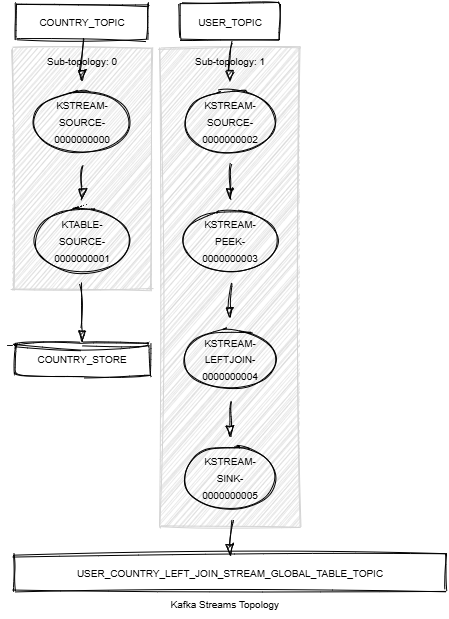

# Kafka Streams Left Join Stream Global Table

This module demonstrates:

- The use of the Kafka Streams DSL: `leftJoin()` between KStream and GlobalKTable, `peek()`.
- The use of unit tests with Topology Test Driver.

This module does:

- Stream records of type <String,KafkaPerson> from a topic named PERSON_TOPIC.
- Stream records of type <String,KafkaCountry> from a topic named COUNTRY_TOPIC.
- Join the two streams on the country code and create a new object KafkaJoinPersonCountry with the person and country information. If no country has been matched, a value holding the person is still emitted as a `leftJoin()` is performed.
- Write the resulting KafkaJoinPersonCountry objects to a new topic named PERSON_COUNTRY_LEFT_JOIN_STREAM_GLOBAL_TABLE_TOPIC.



## Requirements

To compile and run this demo, you will need the following:

- Java 17
- Maven
- Docker

## Running the Application

To run the application manually, please follow the steps below:

- Start a [Confluent Platform](https://docs.confluent.io/platform/current/quickstart/ce-docker-quickstart.html#step-1-download-and-start-cp) in a Docker environment.
- Produce records of type <String,KafkaCountry> to a topic named COUNTRY_TOPIC. You can use the [producer country](../specific-producers/kafka-streams-producer-country) to do this.
- Produce records of type <String,KafkaPerson> to a topic named PERSON_TOPIC. You can use the [producer person](../specific-producers/kafka-streams-producer-person) to do this.
- Start the Kafka Streams.

To run the application in Docker, please use the following command:

```console
docker-compose up -d
```

This command will start the following services in Docker:

- 1 Zookeeper
- 1 Kafka broker
- 1 Schema registry
- 1 Control Center
- 1 producer country
- 1 producer person
- 1 Kafka Streams left join stream global table
