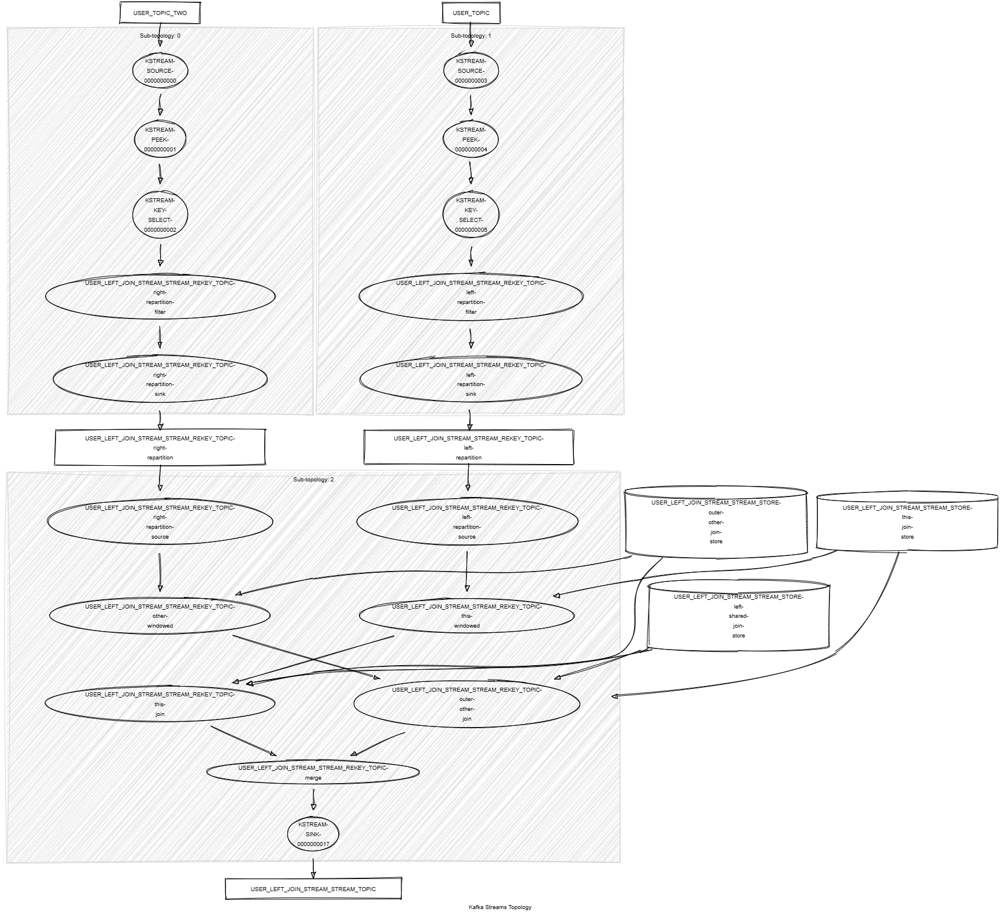

# Kafka Streams Left Join Stream Stream

This module demonstrates the following:

- The usage of the Kafka Streams DSL, including `leftJoin()` between KStream and KStream, `selectKey()`, `peek()`.
- The usage of sliding time windows.
- Unit testing using the Topology Test Driver.

In this module, records of type `<String, KafkaPerson>` are streamed from two topics named `PERSON_TOPIC` and `PERSON_TOPIC_TWO`.
The following tasks are performed:

1. Join the records on the last name within a 5-minute time window and a 1-minute grace period for delayed records.
2. Build a new `KafkaJoinPersons` object that holds both persons. If no person is matched for a record, a value holding the left person is still emitted as a result of the `leftJoin()` operation.
3. Write the resulting `KafkaJoinPersons` objects to a new topic named `PERSON_LEFT_JOIN_STREAM_STREAM_TOPIC`.



## Requirements

To compile and run this demo, you will need the following:

- Java 17
- Maven
- Docker

## Running the Application

To run the application manually, please follow the steps below:

- Start a [Confluent Platform](https://docs.confluent.io/platform/current/quickstart/ce-docker-quickstart.html#step-1-download-and-start-cp) in a Docker environment.
- Produce records of type `<String, KafkaPerson>` to topics named `PERSON_TOPIC` and `PERSON_TOPIC_TWO`. You can use the [producer person](../specific-producers/kafka-streams-producer-person) to do this.
- Start the Kafka Streams.

To run the application in Docker, please use the following command:

```console
docker-compose up -d
```

This command will start the following services in Docker:

- 1 Zookeeper
- 1 Kafka broker
- 1 Schema registry
- 1 Control Center
- 1 producer person
- 1 Kafka Streams left join stream stream
