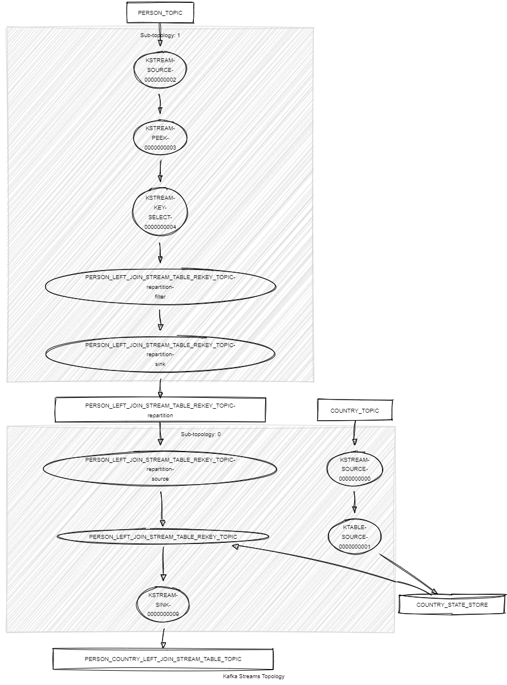

# Kafka Streams Left Join Stream Table

This module demonstrates the following:

- The use of the Kafka Streams DSL, including `leftJoin()` between KStream and KTable, `selectKey()` and `peek()`.
- Unit testing using Topology Test Driver.

In this module, records of type `<String, KafkaUser>` are streamed from a topic named `USER_TOPIC`, and records of
type `<String, KafkaCountry>` are streamed from a topic named `COUNTRY_TOPIC`.
The following tasks are performed:

1. Join the two streams on the country code and create a new object `KafkaJoinUserCountry` that contains the user
   and country information. If no country is matched for a user, a value holding the user is still emitted as a
   result of the `leftJoin()` operation.
2. Write the resulting `KafkaJoinUserCountry` objects to a new topic
   named `USER_COUNTRY_LEFT_JOIN_STREAM_TABLE_TOPIC`.



## Prerequisites

To compile and run this demo, you will need the following:

- Java 21
- Maven
- Docker

## Running the Application

To run the application manually:

- Start a [Confluent Platform](https://docs.confluent.io/platform/current/quickstart/ce-docker-quickstart.html#step-1-download-and-start-cp) in a Docker environment.
- Produce records of type `<String, KafkaCountry>` to a topic named `COUNTRY_TOPIC`. You can use the [producer country](../specific-producers/kafka-streams-producer-country) to do this.
- Produce records of type `<String, KafkaUser>` to a topic named `USER_TOPIC`. You can use the [producer user](../specific-producers/kafka-streams-producer-user) to do this.
- Start the Kafka Streams application.

To run the application in Docker, use the following command:

```console
docker-compose up -d
```

This command will start the following services in Docker:

- 1 Kafka broker (KRaft mode)
- 1 Schema registry
- 1 Control Center
- 1 producer Country
- 1 producer User
- 1 Kafka Streams Left Loin Stream Table
