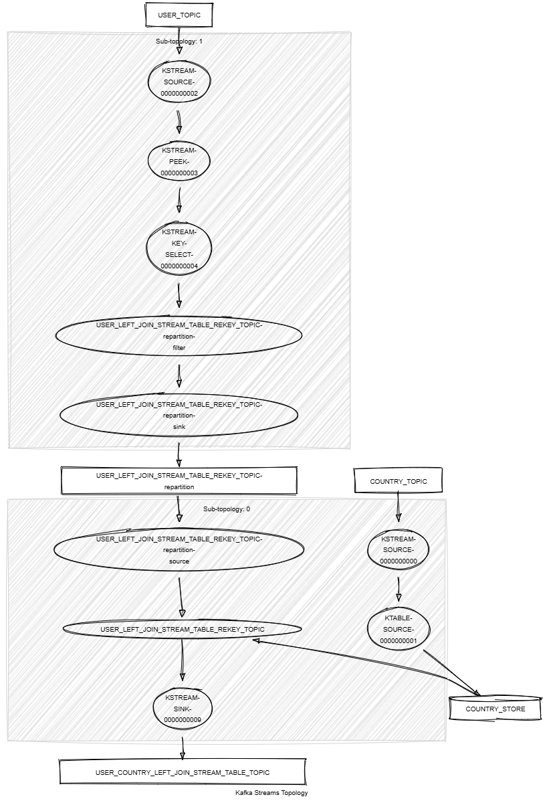

# Kafka Streams Left Join Stream Table

This module shows:
- Kafka Streams API: `leftJoin()` between KStream and KTable, `selectKey()`, `repartition()`, `toTable()`, `peek()`
- unit tests with Topology Test Driver

This module does:
- stream <String,KafkaPerson> records from a topic named PERSON_TOPIC
- stream <String,KafkaCountry> records from a topic named COUNTRY_TOPIC
- rekey both streams on same key: the country code
- join matching records and build a new KafkaJoinPersonCountry object that holds both person and country information. If no country has been matched, a value holding the person is still emitted as a `leftJoin()` is performed
- write the result into a new topic named PERSON_COUNTRY_LEFT_JOIN_STREAM_TABLE_TOPIC



## Requirements

To compile and run this demo you will need:
- Java 17
- Maven
- Docker

## Run the app

For manual run:
- start a [Confluent Platform](https://docs.confluent.io/platform/current/quickstart/ce-docker-quickstart.html#step-1-download-and-start-cp) in Docker
- produce <String,KafkaCountry> records to a topic named COUNTRY_TOPIC. The [producer country](../specific-producers/kafka-streams-producer-country) can be used
- produce <String,KafkaPerson> records to a topic named PERSON_TOPIC. The [producer person](../specific-producers/kafka-streams-producer-person) can be used
- start the Kafka Streams

For Docker run:
- start the provided docker-compose 

```
docker compose up -d
```

The docker compose runs:
- 1 Zookeeper
- 1 Kafka broker
- 1 Schema registry
- 1 Control Center
- 1 producer country
- 1 producer person
- 1 Kafka Streams left join stream table
