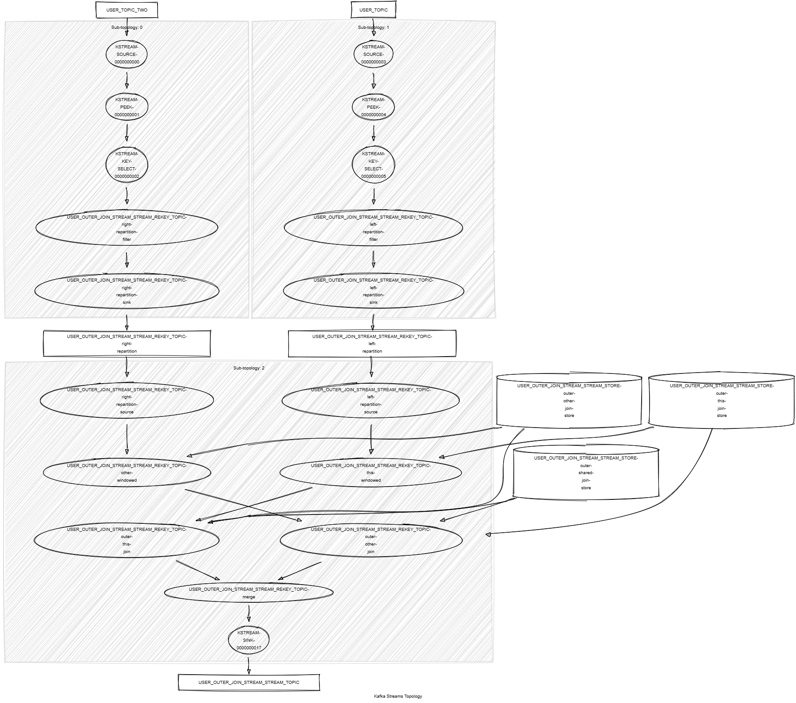

# Kafka Streams Outer Join Stream Stream

This module shows:
- Kafka Streams API: `outerJoin()` between KStream and KStream, `selectKey()`, `peek()`
- sliding time windows
- unit tests with Topology Test Driver

This module does:
- stream <String,KafkaPerson> records from topics named PERSON_TOPIC and PERSON_TOPIC_TWO
- join records matching by last name within a 2 minutes time window and a 30 seconds grace period for delayed records
- build a new KafkaJoinPersons object that holds both persons. If no person has been matched, a value holding the left or right person is still emitted as a `outerJoin()` is performed
- write the result into a new topic named PERSON_LEFT_JOIN_STREAM_STREAM_TOPIC



## Requirements

To compile and run this demo you will need:
- Java 17
- Maven
- Docker

## Run the app

For manual run:
- start a [Confluent Platform](https://docs.confluent.io/platform/current/quickstart/ce-docker-quickstart.html#step-1-download-and-start-cp) in Docker
- produce <String,KafkaPerson> records to topics named PERSON_TOPIC and PERSON_TOPIC_TWO. The [producer person](../specific-producers/kafka-streams-producer-person) can be used
- start the Kafka Streams

For Docker run:
- start the provided docker-compose 

```
docker compose up -d
```

The docker compose runs:
- 1 Zookeeper
- 1 Kafka broker
- 1 Schema registry
- 1 Control Center
- 1 producer person
- 1 Kafka Streams outer join stream stream
