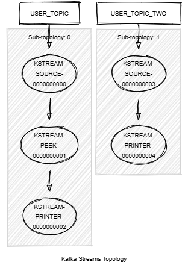

# Kafka Streams Print

This module demonstrates the use of the Kafka Streams API: `print()`, `peek()`.

This module does:

- Stream records of type <String,KafkaPerson> records from a topic named PERSON_TOPIC and print them to file _/tmp/kafka-streams-quickstarts/streams-print-output.log_.
- Stream records of type <String,KafkaPerson> records from a topic named PERSON_TOPIC_TWO and print them to system output.



## Requirements

To compile and run this demo, you will need the following:

- Java 17
- Maven
- Docker

## Running the Application

To run the application manually, please follow the steps below:

- Start a [Confluent Platform](https://docs.confluent.io/platform/current/quickstart/ce-docker-quickstart.html#step-1-download-and-start-cp) in a Docker environment.
- Produce records of type <String,KafkaPerson> to topics named PERSON_TOPIC and PERSON_TOPIC_TWO. You can use the [producer person](../specific-producers/kafka-streams-producer-person) to do this.
- Start the Kafka Streams.

To run the application in Docker, please use the following command:

```console
docker-compose up -d
```

This command will start the following services in Docker:

- 1 Zookeeper
- 1 Kafka broker
- 1 Schema registry
- 1 Control Center
- 1 producer person
- 1 Kafka Streams print