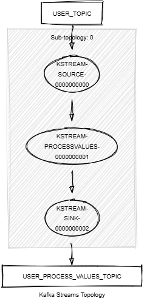

# Kafka Streams Process Values

This module demonstrates the following:

- The use of the Kafka Streams DSL, including `processValues()`.
- Accessing and enriching records with metadata using the processor context.
- Unit testing with the Topology Test Driver.

In this module, records of type `<String, KafkaUser>` are streamed from a topic named `USER_TOPIC`.
The following tasks are performed:

1. Each record is processed using a custom processor that enriches the value with metadata such as the topic, partition,
   and offset information.
2. The processed records with enriched metadata are written to a new topic named `USER_PROCESS_VALUES_TOPIC`.



## Prerequisites

To compile and run this demo, you will need the following:

- Java 21
- Maven
- Docker

## Running the Application

To run the application manually:

- Start a [Confluent Platform](https://docs.confluent.io/platform/current/quickstart/ce-docker-quickstart.html#step-1-download-and-start-cp) in a Docker environment.
- Produce records of type `<String, KafkaUser>` to a topic named `USER_TOPIC`. You can use the [producer user](../specific-producers/kafka-streams-producer-user) to do this.
- Start the Kafka Streams.

To run the application in Docker, use the following command:

```console
docker-compose up -d
```

This command will start the following services in Docker:

- 1 Kafka broker (KRaft mode)
- 1 Schema registry
- 1 Control Center
- 1 producer User
- 1 Kafka Streams Process Values
