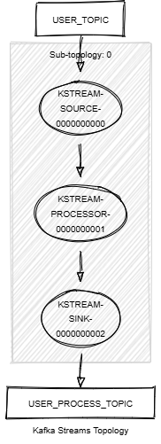

# Kafka Streams Process

This module demonstrates the following:

- The use of the Kafka Streams DSL, including `process()`.
- Accessing and enriching records with metadata using the processor context.
- Unit testing with the Topology Test Driver.

In this module, records of type `<String, KafkaUser>` are streamed from a topic named `USER_TOPIC`.
The following tasks are performed:

1. Each record is processed using a custom processor that enriches the value with metadata such as the topic, partition,
   and offset information. The processor also changes the key of the record by using the last name.
2. The processed records with enriched metadata are written to a new topic named `USER_PROCESS_TOPIC`.



## Prerequisites

To compile and run this demo, you’ll need:

- Java 21
- Maven
- Docker

## Running the Application

To run the application manually:

- Start a [Confluent Platform](https://docs.confluent.io/platform/current/quickstart/ce-docker-quickstart.html#step-1-download-and-start-cp) in a Docker environment.
- Produce records of type `<String, KafkaUser>` to the `USER_TOPIC`. You can use the [producer user](../specific-producers/kafka-streams-producer-user) for this.
- Start the Kafka Streams application.

To run the application in Docker, use the following command:

```console
docker-compose up -d
```

This command starts the following services in Docker:

- 1 Kafka broker (KRaft mode)
- 1 Schema Registry
- 1 Control Center
- 1 Producer User
- 1 Kafka Streams Process
