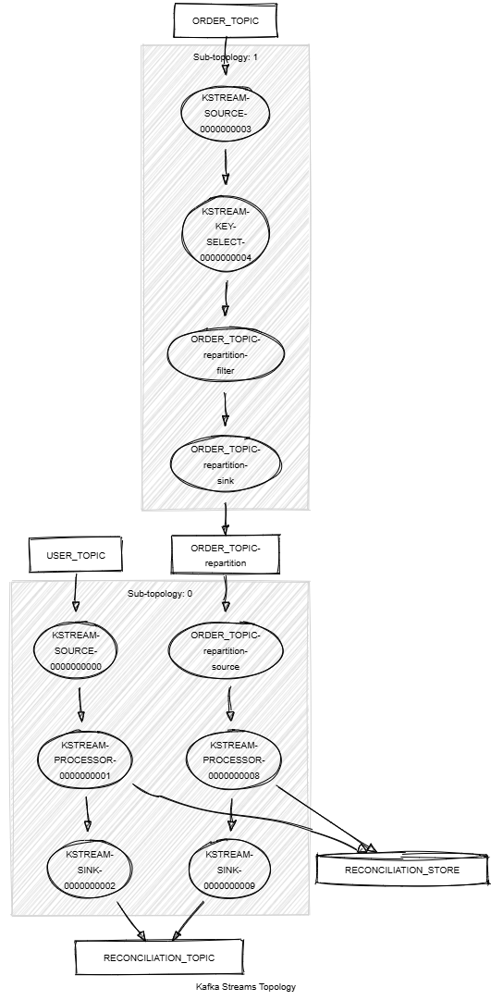

# Kafka Streams Reconciliation

This module streams records of type `<String, KafkaUser>` from the `USER_TOPIC` and `<String, KafkaOrder>` from the `ORDER_TOPIC`, and reconciles an order with its customer.
It demonstrates the following:

- How to reconcile data from two different topics, regardless of the order in which records arrive or how much time passes between them.
- Unit testing using the Topology Test Driver.



## Prerequisites

To compile and run this demo, you’ll need:

- Java 21
- Maven
- Docker

## Running the Application

To run the application manually:

- Start a [Confluent Platform](https://docs.confluent.io/platform/current/quickstart/ce-docker-quickstart.html#step-1-download-and-start-cp) in a Docker environment.
- Produce records of type `<String, KafkaUser>` to the `USER_TOPIC`. You can use the [Producer User](../specific-producers/kafka-streams-producer-user) for this.
- Produce records of type `<String, KafkaOrder>` to the `ORDER_TOPIC`. You can use the [Producer Order](../specific-producers/kafka-streams-producer-order) for this.
- Start the Kafka Streams application.

Alternatively, to run the application with Docker, use the following command:

```console
docker-compose up -d
```

This will start the following services in Docker:

- Kafka Broker
- Schema Registry
- Control Center
- Producer User
- Producer Order
- Kafka Streams Reconciliation
