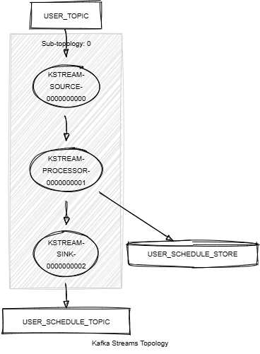

# Kafka Streams Schedule

This module demonstrates the following:

- The usage of the Processor API, including `process()` and `.schedule()`.
- The processor context and the scheduling of tasks based on wall block time and stream time.
- The creation of a timestamped key-value store.
- Unit testing using the Topology Test Driver.

In this module, records of type `<String, KafkaPerson>` are streamed from a topic named `PERSON_TOPIC`.
The following tasks are performed:

1. Processes the stream using a custom processor that performs the following tasks:
    - Counts the number of persons by nationality.
    - Emits all counters of all nationalities every minute, based on the stream time.
    - Resets the counters every two minutes, based on the wall clock time.
2. Writes the processed results to a new topic named `PERSON_SCHEDULE_TOPIC`.



## Requirements

To compile and run this demo, you will need the following:

- Java 21
- Maven
- Docker

## Running the Application

To run the application manually, please follow the steps below:

- Start
  a [Confluent Platform](https://docs.confluent.io/platform/current/quickstart/ce-docker-quickstart.html#step-1-download-and-start-cp)
  in a Docker environment.
- Produce records of type `<String, KafkaPerson>` to a topic named `PERSON_TOPIC`. You can use
  the [producer person](../specific-producers/kafka-streams-producer-person) to do this.
- Start the Kafka Streams.

To run the application in Docker, please use the following command:

```console
docker-compose up -d
```

This command will start the following services in Docker:

- 1 Zookeeper
- 1 Kafka broker
- 1 Schema registry
- 1 Control Center
- 1 producer person
- 1 Kafka Streams schedule
