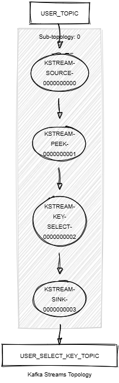

# Kafka Streams Select Key

This module demonstrates the following:

- The use of the Processor API, including `selectKey()` and `peek()`.
- Unit testing using Topology Test Driver.

In this module, records of type `<String, KafkaUser>` are streamed from a topic named `USER_TOPIC`.
The following tasks are performed:

1. Selects the last name of each record as the new key.
2. Writes the resulting records into a new topic named `USER_SELECT_KEY_TOPIC`.



## Prerequisites

To compile and run this demo, you’ll need:

- Java 21
- Maven
- Docker

## Running the Application

To run the application manually:

- Start a [Confluent Platform](https://docs.confluent.io/platform/current/quickstart/ce-docker-quickstart.html#step-1-download-and-start-cp) in a Docker environment.
- Produce records of type <String,KafkaUser> to a topic named USER_TOPIC. You can use the [producer user](../specific-producers/kafka-streams-producer-user) to do this.
- Start the Kafka Streams application.

To run the application in Docker, use the following command:

```console
docker-compose up -d
```

This command will start the following services in Docker:

- 1 Kafka broker (KRaft mode)
- 1 Schema Registry
- 1 Control Center
- 1 producer User
- 1 Kafka Streams Select Key
