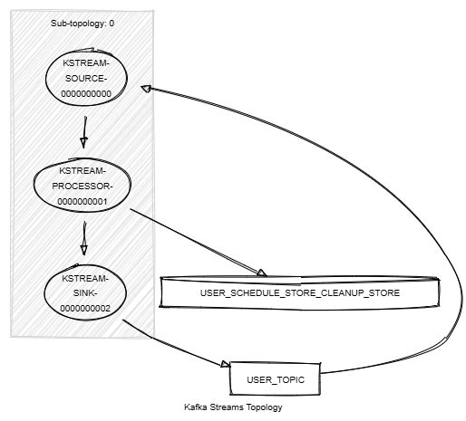

# Kafka Streams Store Cleanup

This module demonstrates the following:

- The use of the Processor API, including `process()`, `addStateStore()` and `.schedule()`.
- The processor context and the scheduling of tasks based on stream time.
- The creation and cleanup of a key-value store.
- Unit testing using Topology Test Driver.

In this module, records of type `<String, KafkaUser>` are streamed from a topic named `USER_TOPIC`.
The following tasks are performed:

1. Processes the stream using a custom processor that performs the following tasks:
    - Pushes new events into the store.
    - Deletes events if they are tombstones.
    - Send tombstones for each key of the store every minute, based on the stream time.



## Requirements

To compile and run this demo, you will need the following:

- Java 21
- Maven
- Docker

## Running the Application

To run the application manually, please follow the steps below:

- Start a [Confluent Platform](https://docs.confluent.io/platform/current/quickstart/ce-docker-quickstart.html#step-1-download-and-start-cp) in a Docker environment.
- Produce records of type `<String, KafkaUser>` to a topic named `USER_TOPIC`. You can use the [producer user](../specific-producers/kafka-streams-producer-user) to do this.
- Start the Kafka Streams.

To run the application in Docker, please use the following command:

```console
docker-compose up -d
```

This command will start the following services in Docker:

- 1 Kafka broker KRaft
- 1 Schema registry
- 1 Control Center
- 1 producer User
- 1 Kafka Streams Store Cleanup
