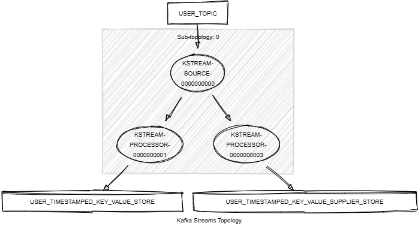

# Kafka Streams Store Key-Value Timestamped

This module demonstrates the following:

- The two strategies for creating timestamped Key-Value stores and attaching them to the topology.
- The use of the Processor API, including `process()` and `addStateStore()`.
- Unit testing using Topology Test Driver.

In this module, records of type `<String, KafkaUser>` are streamed from a topic named `USER_TOPIC`.
The following tasks are performed:

1. Create a first stream that pushes records to a timestamped Key-Value store named `USER_TIMESTAMPED_KEY_VALUE_STORE`.
2. Create a second stream that pushes records to another timestamped Key-Value store named `USER_TIMESTAMPED_KEY_VALUE_SUPPLIER_STORE`.



## Prerequisites

To compile and run this demo, you will need the following:

- Java 21
- Maven
- Docker

## Running the Application

To run the application manually:

- Start a [Confluent Platform](https://docs.confluent.io/platform/current/quickstart/ce-docker-quickstart.html#step-1-download-and-start-cp) in a Docker environment.
- Produce records of type `<String, KafkaUser>` to a topic named `USER_TOPIC`. You can use the [producer user](../specific-producers/kafka-streams-producer-user) to do this.
- Start the Kafka Streams application.

To run the application in Docker, use the following command:

```console
docker-compose up -d
```

This command will start the following services in Docker:

- 1 Kafka broker (KRaft mode)
- 1 Schema registry
- 1 Control Center
- 1 producer User
- 1 Kafka Streams Store Timestamped Key-Value
